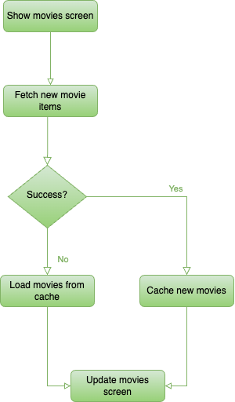

# Movies App
A movies app showing the last trending movies and their descriptions.

## BDD Specs

### Story: Customer requests to see the trending movies


### Narative #1:

> As an online customer
I want the app to automatically load the trending movies
So that I can see the latest trending movies

### Scenarios (Acceptance criteria)

```
Given the customer has connectivity
When the customer requests to see the trending movies
Then the app should display the latest feed from remote
And replace the cache with the newest trending movies
```

### Narative #2

> As an offline customer
I want the app to show the latest saved trending movies
So I can always be aware of the latest trending movies


### Scenarios (Acceptance criteria)

```
Given the customer does not have connectivity
And there is a cached version of the trending movies
When the customer requests to see the movies
Then the app should display the latest saved trending movies

Given the customer does not have connectivity
And the cache is empty
When the customer requests to see the movies
Then the app should display an error message

```

## Use Cases

### Load Movies From Remote Use Case

#### Data:
 - URL

#### Primary course (Happy path):
1. Execute "Load Movies" command with above data.
2. System downloads data from the URL.
3. System validates downloaded data.
4. System creates movies items from valid data.
5. System delivers movies items.

#### Cancel course:
1. System delivers no movies items nor an error.

#### Invalid data - error course (sad path):
1. System delivers invalid data error.

#### No connectivity - error course (sad path):
1. System delivers connectivity error.

### Load Movie Poster Image Data From Remote Use Case

#### Data:
 - URL

#### Primary course (Happy path):
1. Execute "Load Image Data" command with above data.
2. System downloads data from the URL.
3. System validates downloaded data.
4. System delivers image data.

#### Cancel course:
1. System delivers no image data nor an error.

#### Invalid data - error course (sad path):
1. System delivers invalid data error.

#### No connectivity - error course (sad path):
1. System delivers connectivity error.

### Load Movies From Cache Use Case

#### Primary course:
1. Execute "Retrieve Movies" command with above data.
2. System retrieve movies data from cache.
3. System validated cache age(max age TBD).
4. System creates movies items from cached data.
5. System delivers movies items.

#### Retrieval error course (sad path):
1. System delivers error.

#### Expired cache course (sad path):
1. System delivers no movies items.

#### Empty cache course (sad path):
1. System delivers no movies items.


### Load Movie Poster Image Data From Cache Use Case

#### Data:
 - URL

#### Primary course:
1. Execute "Load Image Data" command with above data.
2. System retrieve data from the cache.
3. System delivers cached image data.

#### Cancel course:
1. System delivers no image data nor error.

#### Retrieval error course (sad path):
1. System delivers error.

#### Empty cache course (sad path):
1. System delivers not found error.

## Architecture


## Flowchart




